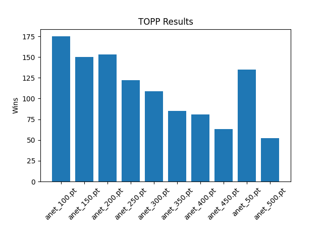
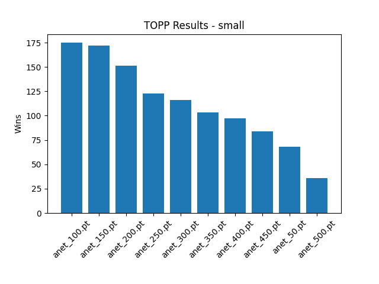

# Experimentation

## Experiment 1 - Simple feedforward neural network:

Just checking that our implementation is able to learn. Hyperparameter:

| Parameter                | Value        |
| ------------------------ | ------------ |
| EXPERIMENT_NAME          | feedforward1 |
| VERBOSE                  | False        |
| VISUALIZE                | False        |
| BOARD_SIZE               | 11           |
| NUMBER_OF_EPISODES       | 500          |
| NUMBER_OF_SIMULATIONS    | 50           |
| ANET_LEARNING_RATE       | 0.01         |
| ANET_NUM_HIDDEN_LAYERS   | 7            |
| ANET_NUM_HIDDEN_NODES    | 100          |
| ANET_ACTIVATION_FUNCTION | relu         |
| ANET_OPTIMIZER           | adam         |
| ANET_M                   | 10           |
| ANET_BATCH_SIZE          | 128          |

This will be running for 24-hours on a 4-CPU Intel Cascade Lake instance

### Experiment 1 Results:

Checking that the model learned something by plotting the results of making the 10 (ANET_M) different saves of the model compete against each other.

We unfortunately see a negative correlation between training time and performance. There is likely a bug in the training code. Also, the board is so large (11) that the model might find it hard to learn.

## Experiment 2 - Smaller board size

In hope that the model would be able to learn better on a smaller board, we try the same hyperparameters as in Experiment 1, but with a board size of 5.

| Parameter       | Value |
| --------------- | ----- |
| EXPERIMENT_NAME | small |
| BOARD_SIZE      | 5     |

### Experiment 2 Results:

The model was not able to learn and we saw a clear negative correlation between training time and performance. The model is seeing some change, but in the wrong direction.

